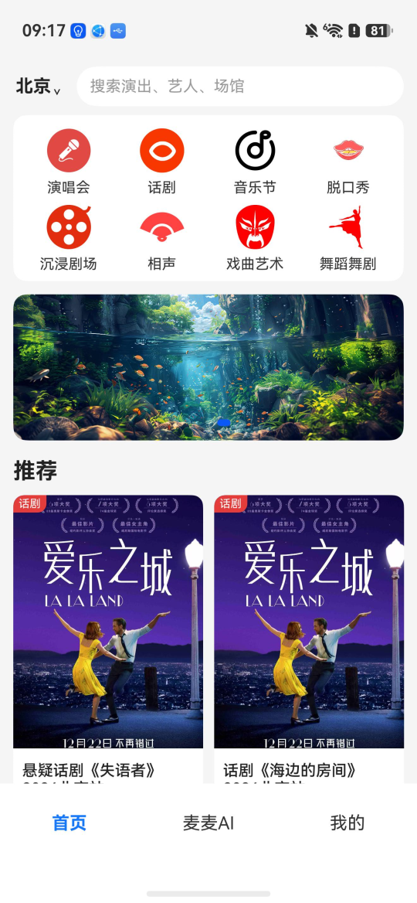
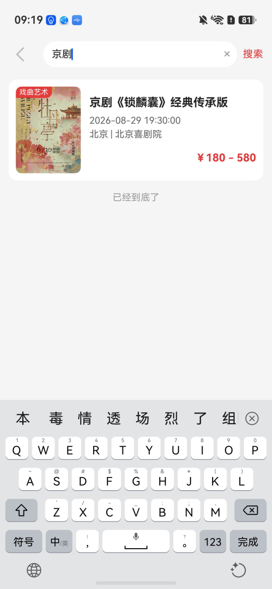
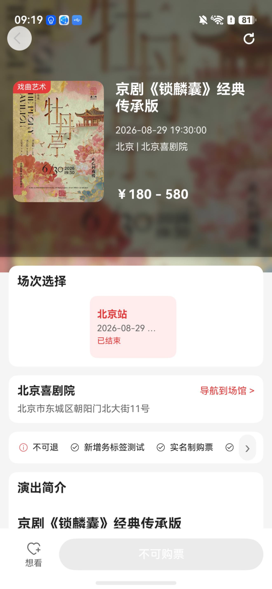
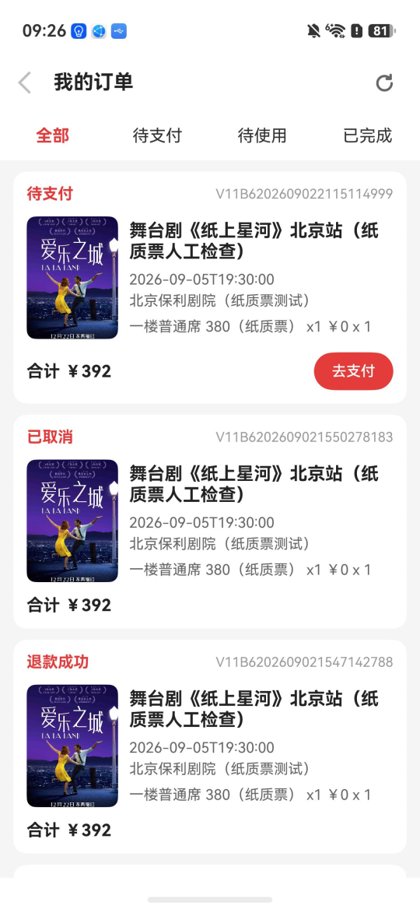
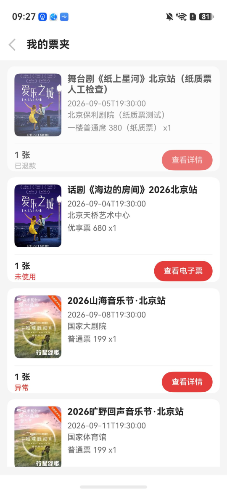
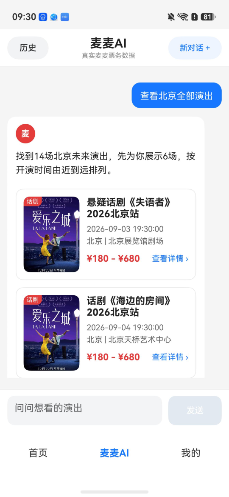
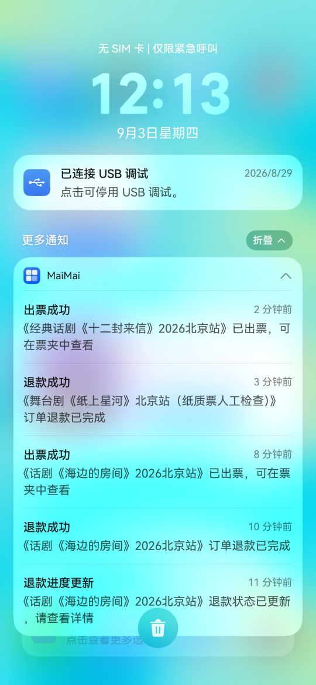
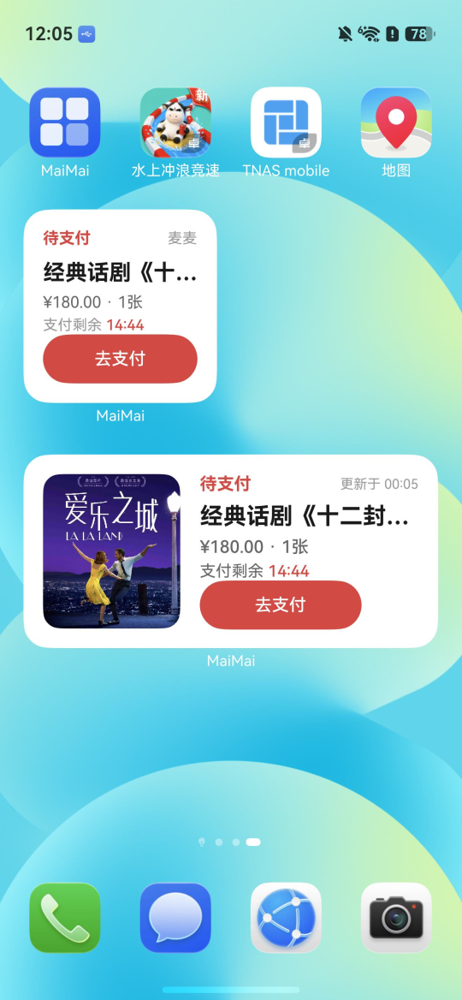
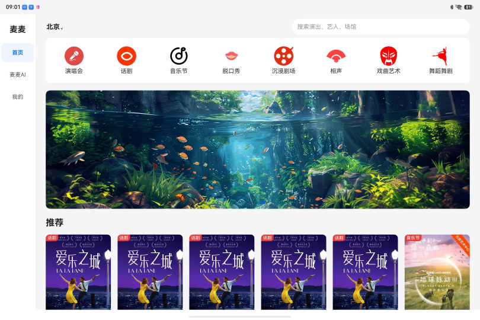
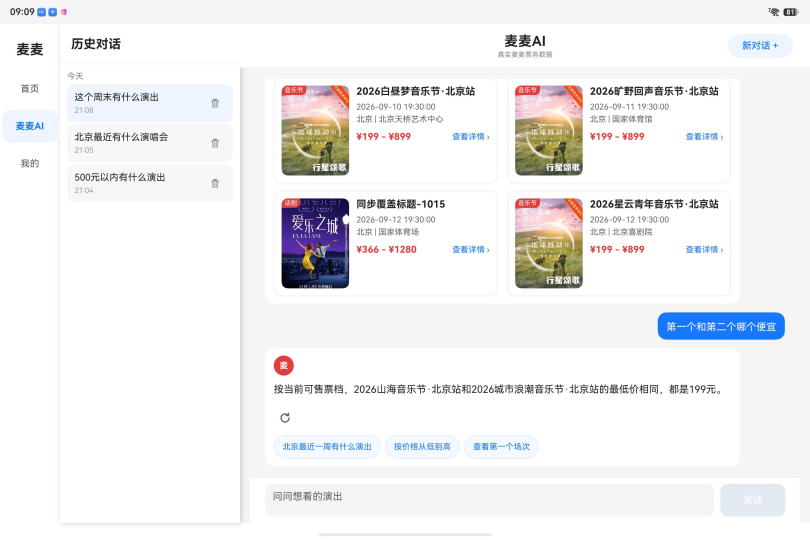

# 麦麦（Maimai）HarmonyOS 票务客户端

麦麦是一个基于 **HarmonyOS / ArkTS / ArkUI** 开发的演出票务客户端，配套 Spring Boot 后端运行。项目以“票务聚合分销平台”的用户端为定位，覆盖演出浏览、搜索、购票、订单、票夹、退款、通知与 AI 票务问答等核心场景，并针对 HarmonyOS 的导航、服务卡片、通知、响应式布局和冷启动性能进行了专项增强。

> 客户端只面向麦麦统一业务 API，不直接调用第三方票源，也不向用户暴露 Provider 内部字段。

---

## 项目演示


### 手机端

<table>
  <tr>
    <td align="center"><br>首页</td>
    <td align="center"><br>搜索</td>
    <td align="center"><br>演出详情</td>
  </tr>
  <tr>
    <td align="center"><br>订单</td>
    <td align="center"><br>票夹</td>
    <td align="center"><br>AI</td>
  </tr>
 <tr>
    <td align="center"><br>通知</td>
    <td align="center"><br>服务卡片</td>
    
  </tr>
</table>

### 平板 / 大窗口

<table>
  <tr>
    <td align="center"><br>响应式首页</td>
    <td align="center"><br>AI 宽屏布局</td>
  </tr>
</table>

---

## 核心业务流程

```text
首页 / 分类 / 搜索 / AI 搜索
              ↓
           演出详情
              ↓
       选择场次 + 一个票档
              ↓
      选择数量 + 实名观演人
              ↓
           提交订单
              ↓
            支付
              ↓
        出票 / 订单 / 票夹
              ↓
             退款
```

当前订单模型：

```text
一个订单
= 一个项目
+ 一个场次
+ 一个票档
+ N 张同票档票
```

每张实名票绑定一个不同观演人，不支持一个订单跨场次或混合多个票档。

---

## HarmonyOS 工程亮点

### 1. Navigation 核心业务栈

核心票务流程使用 `Navigation + NavPathStack` 管理，外围独立页面继续使用 Router。

```text
Navigation：
首页 → 详情 → 选票 → 下单 → 订单 → 票夹

Router：
登录 / 城市 / 设置 / 资料 / 地址 / 观演人 / 协议等
```

复杂共享元素转场已移除，保留稳定、简单的页面转场，避免交互与性能回退。

### 2. 长列表与首屏缓存

首页、分类和搜索针对长列表场景进行了性能处理：

- 分页加载；
- `LazyForEach`；
- `@Reusable`；
- 触底加载；
- Memory Cache；
- 首页首屏持久缓存；
- 返回页面尽量恢复原数据与滚动状态；
- 刷新时保留已有内容，避免整页闪白。

缓存 Key 会包含城市及筛选条件，避免跨城市数据串用。

### 3. 演出详情与视频

演出详情支持：

- 沉浸式 Hero；
- 滚动标题栏；
- 二级吸顶锚点导航；
- 服务标签、观演须知和退款信息；
- 基于 AVPlayer / XComponent 的视频播放；
- 播放、暂停、进度、拖动、静音、失败态；
- 全屏与横竖屏恢复；
- 视频按需初始化，不进入冷启动关键路径。

### 4. 响应式多设备适配

布局只根据窗口宽度和实际可用内容宽度判断，不依赖物理设备类型。

```text
sm  < 600vp
md  600–839vp
lg  840–1439vp
xl  >= 1440vp
```

主要行为：

- `sm / md` 使用底部导航, `lg / xl` 使用侧边导航；
- 首页推荐区根据宽度动态调整列数；
- 首页 Banner 保持比例并限制最大宽度；
- `sm` 搜索进入完整 `SearchPage`，`md / lg / xl` 使用轻量 `TabletSearchPanel`；
- 分类页在宽屏提供独立筛选区域；
- 搜索结果使用响应式网格；
- AI 在大内容宽度下显示历史侧栏；
- AI 多结果根据“正文实际可用宽度”决定单列或双列，避免折叠屏/平板卡片拥挤；
- 手机支付使用底部面板，宽屏使用居中定宽弹窗。


### 5. 服务卡片与 Deep Link

提供 HarmonyOS 服务卡片：

- 2×2；
- 2×4；
- 待支付；
- 出票中；
- 下一场；
- 热门演出。

服务卡片可通过 Deep Link 回到 App 对应业务页面。

### 6. Push 与本地观演提醒

通知能力包括：

- 出票成功；
- 出票异常 / 失败；
- 退款进度 / 成功 / 失败；
- 演出改期；
- 演出取消；
- 场馆变更；
- 想看开售。

同时支持本地观演 Reminder：

```text
开演前 24 小时
开演前 2 小时
```

Reminder 使用系统代理能力，应用进程结束后仍可触发。通知点击可分发到对应业务页面。

### 7. 麦麦 AI

客户端内置 AI Tab，通过真实 SSE 流式协议连接后端 AI Gateway。

支持票务搜索与连续追问，例如：

```text
北京最近有什么演出？
第二个演出什么时候举行？
这些里面哪些还有票？
哪个最便宜？
它能退吗？
```

AI 票务事实由后端 Tool / 数据库提供，当前核心 Tool 包括：

```text
searchPerformances
getPerformanceDetail
getSessions
getTicketSkus
getRefundRule
```

支持：

- CITY / TIME / PRICE / CATEGORY / VENUE / SORT；
- 多轮 Search Context；
- “第一个 / 第二个 / 最后一个”等结果引用；
- “它 / 这个演出”等实体连续追问；
- 当前结果集合批量查询；
- 最低价 / 最高价 / 更早等比较；
- 轻量 Markdown / 富文本回答；
- 多行自适应输入框；
- SSE 停止、失败和重试状态。

AI 不直接执行付款、退款提交等不可逆业务操作。

### 8. 启动性能

启动性能专项包括：

- EntryAbility 最小化；
- 首页缓存首屏；
- 首帧后延迟初始化；
- AI 懒创建；
- 视频懒初始化；
- 消除首页重复刷新；
- 启动阶段埋点。

一次 AGC 云测试阶段性样本中，HarmonyOS XPerf `AppStart` e2e 从约 **646 ms** 降至 **620 ms**，桌面点击到 ArkUI 首帧从约 **551 ms** 降至 **530 ms**；首页缓存数据在 Ability 创建后约 **230 ms** 可用。该数据用于性能优化前后对比，不代表所有设备上的固定耗时。

---

## 技术栈

| 项目 | 当前实现 |
|---|---|
| 语言 | ArkTS |
| UI | ArkUI |
| 应用模型 | Stage |
| HarmonyOS targetSdkVersion | 6.1.0(23) |
| 架构 | MVVM + Repository |
| 核心导航 | Navigation / NavPathStack |
| 外围页面 | Router |
| 网络 | HTTP / JSON + SSE |
| 媒体 | AVPlayer + XComponent |
| 通知 | Push + Agent Reminder |
| 数据策略 | Memory Cache + 首屏持久缓存 |
| 后端 | Spring Boot REST API |
| 主模块 | `entry` |
| 城市模块 | `module_city_select` |

主要调用关系：

```text
ArkUI Page / Component
        ↓
     ViewModel
        ↓
     Repository
        ↓
 ApiClient / AiSseClient
        ↓
 Spring Boot Backend
```

---

## 系统关系

```text
HarmonyOS App
     │
     ├─ HTTP / JSON ───────────────┐
     │                             │
     └─ SSE / AI ──────────────────┤
                                   ▼
                         maimai-backend
                           │        │
                           │        └─ AI Gateway
                           │            ↓
                           │      OpenAI-compatible LLM
                           │
                           └─ Provider Gateway
                                   ↓
                           第三方票源 / LOCAL_MOCK
```

前端不会直接请求 Provider。新增第三方票源时，正常情况下由后端扩展 Adapter / Gateway，客户端继续使用统一业务模型。

---

## 主要目录

```text
entry/src/main/ets/
├─ cache/             # 页面与首屏缓存
├─ common/            # 响应式布局、通用组件
├─ components/        # 业务组件 / 媒体组件
├─ entryability/      # EntryAbility
├─ entryformability/  # 服务卡片 FormAbility
├─ features/ai/       # AI 页面、SSE、会话与组件
├─ model/             # Entity / Enum / VO
├─ navigation/        # Navigation / Deep Link 分发
├─ network/           # ApiClient / ApiConfig
├─ notification/      # Push / Reminder
├─ pages/             # 主要 ArkUI 页面
├─ repository/        # 后端数据访问
├─ servicecard/       # 2×2 / 2×4 服务卡片
├─ utils/             # 登录态、校验、刷新通知等
└─ viewmodel/         # 页面状态与交互逻辑
```

---

## 运行环境

```text
DevEco Studio：支持 HarmonyOS 6.1.0 SDK
HarmonyOS SDK：6.1.0(23)
运行模块：entry
后端：maimai-backend
数据库：MySQL
```

### API 地址

客户端通过 `ApiConfig.BASE_URLS` 访问后端。

本地模拟器/本机联调可按环境配置：

```text
http://127.0.0.1:8080
http://localhost:8080
```

或者本地 Spring Boot 需要暴露为公网 HTTPS 地址。项目开发阶段使用过 Cloudflare Quick Tunnel；

---

## 当前实现边界

该项目用于完整业务链与 HarmonyOS 工程能力演示，以下能力仍属于测试 / 模拟环境：

- 第三方票源主要使用 `LOCAL_MOCK`；
- 支付为 Mock 支付，不接真实资金渠道；
- 短信验证码不是生产短信服务；
- 不支持用户自主选座；
- 纸质票相关模型和后端链路有预留/部分能力，但客户端当前正式展示重点仍是电子票与票夹流程；
- AI 使用 OpenAI-compatible 模型接口，是否启用及模型由后端环境变量控制；
- Push 需要正确的 AGC 项目、签名和服务账号配置。


---

## 配套后端

配套服务：`maimai-backend`

后端负责：

- 演出 / 场次 / 票档与平台运营数据；
- Provider Adapter / Gateway；
- 库存和价格最终校验；
- 订单幂等与异常恢复；
- 出票、票凭证、退款；
- Push 通知事件；
- AI Gateway 与票务 Tool；
- Thymeleaf 运营后台。
