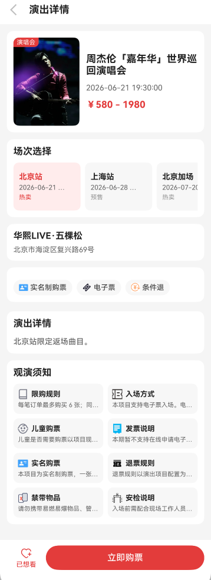
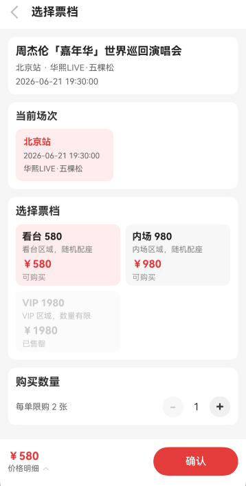
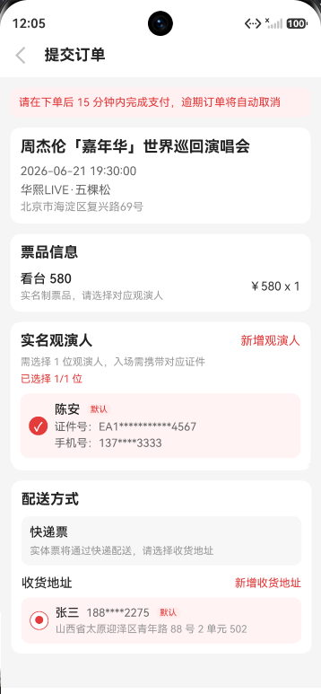
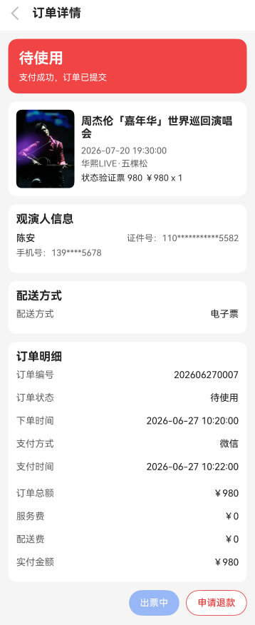
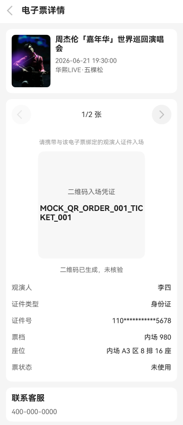

# HarmonyOS Ticket App

一个基于 HarmonyOS / ArkTS / ArkUI 开发的票务类客户端项目，业务形态参考大麦、猫眼等演出票务 App。当前版本为 **v1.0.0 一期前端 Mock 完成版**，重点完成客户端页面、Mock 数据驱动、MVVM 分层、Repository 数据层以及核心购票业务闭环。

> 当前项目为学习展示项目，后端接口、数据库、后台管理系统、真实支付、真实出票等能力将在二期规划中逐步补充。

---

## 项目定位

本项目用于模拟演出票务 App 的核心业务流程，覆盖从浏览演出、选择城市、搜索分类、查看详情、选择票档、提交订单、支付成功、生成电子票、查看票夹到申请退款的完整链路。

一期目标不是接入真实票务服务，而是在前端通过 Mock 数据模拟接口返回，完成一个具备真实业务结构的 HarmonyOS 客户端项目。

---

## 技术栈

| 类型 | 技术 |
|---|---|
| 开发语言 | ArkTS |
| UI 框架 | ArkUI |
| 系统模型 | Stage 模型 |
| 工程平台 | HarmonyOS / DevEco Studio |
| SDK 版本 | 6.1.0(23) |
| 架构模式 | MVVM + Repository |
| 数据来源 | Mock 数据 |
| 模块化 | entry 主模块 + module_city_select 城市选择模块 |

---

## 当前版本

```text
版本：v1.0.0
阶段：一期前端 Mock 完成版
状态：已完成客户端核心业务闭环
```

当前版本主要完成：

- 首页、分类、搜索、城市选择
- 演出详情、票档选择、提交订单、支付成功
- 订单列表、订单详情、申请退款
- 票夹列表、票夹详情
- 登录、个人中心、观演人管理、收货地址管理、想看功能
- 基于 Mock 数据模拟演出、场次、票档、库存、订单、电子票、退款等业务数据
- 基于 Repository + ViewModel + VO 完成页面数据组织与状态管理

---

## 功能模块

### 首页模块

- Banner 展示
- 分类入口
- 当前城市展示与切换
- 推荐演出列表
- 跳转演出详情

### 城市选择模块

- 使用独立城市选择模块 `module_city_select`
- 支持城市选择与页面回传
- 首页根据选择城市刷新推荐内容

### 分类与搜索模块

- 演出分类展示
- 分类列表筛选
- 搜索页
- 搜索结果页
- 搜索历史 Mock

### 演出详情模块

- 演出基础信息展示
- 场次信息展示
- 场馆信息展示
- 服务标签展示
- 观演须知展示
- 想看 / 取消想看
- 跳转票档选择页

### 票档选择模块

- 根据演出场次展示票档
- 票档状态展示：在售、售罄、停售
- 选择票档和数量
- 提交至确认订单页

### 提交订单模块

- 展示演出、场次、票档、数量、金额
- 选择观演人
- 选择收货地址
- 校验实名购票信息
- 校验场次、票档、库存、限购规则
- 创建待支付订单

### 支付模块

- Mock 支付弹窗
- 模拟支付成功
- 支付成功后更新订单状态
- 扣减 / 锁定库存
- 生成电子票
- 跳转支付成功页

### 订单模块

- 订单列表
- 订单详情
- 待支付倒计时
- 取消订单
- 支付订单
- 查看电子票
- 申请退款
- 订单状态刷新

### 退款模块

- 退款申请页
- 退款规则展示
- 条件退 / 不可退规则模拟
- 提交退款申请
- 退款后刷新来源页订单状态

### 票夹模块

- 电子票列表
- 电子票详情
- 二维码展示 Mock
- 票状态展示：未使用、已检票、已失效、生成中、异常

### 用户模块

- 手机验证码登录 Mock
- 个人中心
- 用户资料
- 观演人管理
- 收货地址管理
- 想看列表

---

## 核心业务流程

```text
首页 / 分类 / 搜索
        ↓
演出详情页
        ↓
选择场次 / 票档
        ↓
提交订单
        ↓
Mock 支付成功
        ↓
生成电子票
        ↓
订单详情 / 票夹详情
        ↓
申请退款
        ↓
订单状态刷新
```

---

## 项目结构

```text
entry/src/main/ets
├── common                  # 公共组件与通用能力
│   ├── PayOrderDialog.ets
│   ├── MediaResourceUtil.ets
│   └── WindowImmersiveUtil.ets
│
├── mock                    # Mock 数据
│   ├── banner
│   ├── category
│   ├── config
│   ├── order
│   ├── performance
│   ├── search
│   ├── ticket
│   ├── user
│   └── want
│
├── model                   # 数据模型
│   ├── entity              # 实体模型
│   ├── enums               # 枚举
│   └── vo                  # 页面展示 VO
│
├── pages                   # 页面
│   ├── city
│   ├── home
│   ├── mine
│   ├── order
│   ├── performance
│   ├── search
│   ├── ticket
│   ├── user
│   └── want
│
├── repository              # 数据仓库层
│   ├── HomeRepository.ets
│   ├── PerformanceRepository.ets
│   ├── SessionRepository.ets
│   ├── OrderRepository.ets
│   ├── PayRepository.ets
│   ├── RefundRepository.ets
│   ├── TicketRepository.ets
│   ├── UserRepository.ets
│   ├── AudienceRepository.ets
│   ├── AddressRepository.ets
│   ├── SearchRepository.ets
│   ├── WantRepository.ets
│   └── CityRepository.ets
│
├── utils                   # 工具类
│   ├── DateTimeUtil.ets
│   ├── IdGenerator.ets
│   ├── AppStorageVersionUtil.ets
│   ├── UserSessionUtil.ets
│   ├── AddressRegionUtil.ets
│   └── ...
│
└── viewmodel               # ViewModel 层
    ├── HomeViewModel.ets
    ├── CategoryViewModel.ets
    ├── PerformanceDetailViewModel.ets
    ├── TicketSelectViewModel.ets
    ├── SubmitOrderViewModel.ets
    ├── OrderListViewModel.ets
    ├── OrderDetailViewModel.ets
    ├── RefundApplyViewModel.ets
    ├── TicketFolderViewModel.ets
    ├── UserViewModel.ets
    └── ...

module_city_select          # 城市选择模块
```

---

## 页面清单

| 页面 | 路径 | 说明 |
|---|---|---|
| 首页 | `pages/home/HomePage` | Banner、分类入口、推荐演出 |
| 城市选择 | `pages/city/CitySelectPage` | 城市选择与回传 |
| 搜索 | `pages/search/SearchPage` | 搜索输入与历史 |
| 搜索结果 | `pages/search/SearchResultPage` | 搜索结果列表 |
| 分类 | `pages/performance/CategoryPage` | 分类演出列表 |
| 演出详情 | `pages/performance/PerformanceDetailPage` | 演出详情、场次、场馆、服务须知 |
| 票档选择 | `pages/performance/TicketSelectPage` | 票档与数量选择 |
| 提交订单 | `pages/order/SubmitOrderPage` | 观演人、地址、订单确认 |
| 支付成功 | `pages/order/PaySuccessPage` | 支付成功结果页 |
| 订单列表 | `pages/order/OrderListPage` | 全部订单与状态筛选 |
| 订单详情 | `pages/order/OrderDetailPage` | 订单信息、支付、取消、退款入口 |
| 申请退款 | `pages/order/RefundApplyPage` | 退款规则与退款提交 |
| 票夹列表 | `pages/ticket/TicketFolderPage` | 电子票列表 |
| 票夹详情 | `pages/ticket/TicketDetailPage` | 电子票详情与二维码 |
| 登录 | `pages/user/LoginPage` | 手机验证码登录 Mock |
| 个人资料 | `pages/user/UserProfilePage` | 用户资料展示 |
| 观演人管理 | `pages/user/AudiencePage` | 观演人列表 |
| 观演人编辑 | `pages/user/AudienceEditPage` | 新增 / 编辑观演人 |
| 地址管理 | `pages/user/AddressPage` | 收货地址列表 |
| 地址编辑 | `pages/user/AddressEditPage` | 新增 / 编辑地址 |
| 想看 | `pages/want/WantPage` | 想看演出列表 |
| 我的 | `pages/mine/MinePage` | 个人中心入口 |

---


## 运行环境：

```text
DevEco Studio：建议使用支持 HarmonyOS 6.1.0 SDK 的版本
HarmonyOS SDK：6.1.0(23)
运行模块：entry
```

---

## 截图展示

| 首页 | 演出详情 | 票档选择 |
|---|---|---|
| (docs/images/home.png) | (docs/images/detail.png) | (docs/images/ticket-select.png) |

| 提交订单 | 订单详情 | 票夹详情 |
|---|---|---|
| (docs/images/submit-order.png) | (docs/images/order-detail.png) | (docs/images/ticket-detail.png) |

---

## 后续规划

### v2.0.0：后端接口与数据库

- 使用 SpringBoot + MySQL 搭建后端服务
- 将 Mock 数据迁移至数据库
- 实现演出、场次、票档、订单、电子票、退款等客户端接口
- 前端 Repository 从 Mock 数据切换为后端接口

### v2.1.0：前后端联调

- 首页、分类、搜索接入真实接口
- 详情、票档、订单接入真实接口
- 支付成功、出票、退款状态流转后端化

### v3.0.0：后台管理系统

- 演出项目管理
- 场次管理
- 票档管理
- Banner 配置
- 服务标签配置
- 观演须知配置
- 退款规则配置
- 首页推荐配置

---

## 当前边界

当前版本暂不包含：

- 真实后台管理系统
- 真实支付
- 真实票务 API
- 真实出票
- 真实检票
- 演出变更通知
- 搜索联想
- 活动专题

这些能力会在二期及后续版本中逐步规划。

---

## 版本记录

| 版本 | 说明 |
|---|---|
| v1.0.0 | 一期前端 Mock 完成版，完成客户端核心业务闭环 |

---

## 说明

本项目为个人学习展示项目，仅用于 HarmonyOS 客户端开发练习，不用于商业用途。项目中的演出、订单、支付、电子票、退款等数据均为 Mock 数据。
